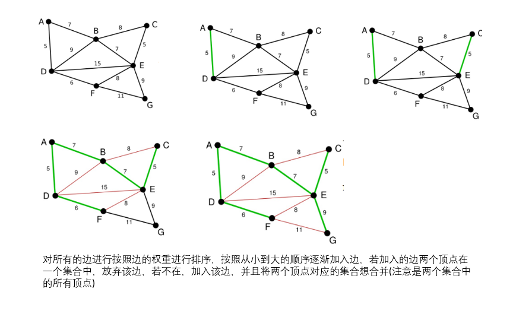

# 最小生成树之Kruskal算法

最小生成树的解释见Prim算法的笔记

**Kruskal算法**简介

1).记Graph中有v个顶点，e个边

2).新建图Graphnew，Graphnew中拥有原图中相同的e个顶点，但没有边

3).将原图Graph中所有e个边按权值从小到大排序

4).循环：从权值最小的边开始遍历每条边 直至图Graph中所有的节点都在同一个连通分量中

                if 这条边连接的两个节点于图Graphnew中不在同一个连通分量中

                                         添加这条边到图Graphnew中

 图例来自[华山大师兄的博客](http://www.cnblogs.com/biyeymyhjob/archive/2012/07/30/2615542.html)



C++ 代码

```c++
/*
最小生成树 Kruskal 算法
*/

#include <iostream>
#include <vector>
#include <algorithm>
#define MAX 10000000

using namespace std;

char VNode[] = { 'A', 'B', 'C', 'D', 'E', 'F', 'G' };
struct edge{
	int start;
	int end;
	int w;
	
};
ostream& operator << (ostream& os,edge& e){
	os << VNode[e.start] << " --> " << VNode[e.end] << " weight = "<< e.w;
	return os;
}


bool comp(edge e1, edge e2){
	return e1.w < e2.w;
}

int main(void){

	const int n = sizeof(VNode) / sizeof(char);
	int Matrix[n][n] = {
		// A,B,C,D,E,F,G
		{ MAX, 7, MAX, 5, MAX, MAX, MAX },
		{ 7, MAX, 8, 9, 7, MAX, MAX },
		{ MAX, 8, MAX, MAX, 5, MAX, MAX },
		{ 5, 9, MAX, MAX, 15, 6, MAX },
		{ MAX, 7, 5, 15, MAX, 8, 9 },
		{ MAX, MAX, MAX, 6, 8, MAX, 11 },
		{ MAX, MAX, MAX, MAX, 9, 11, MAX }
	};

	vector<edge> edgeArray;  //所有的边
	vector<int> nodeSet(n,0);  //每个顶点对应的set 最后最小生成树生成时，所有的点nodeSet值都一样

	for (int i = 0; i < n; i++){
		for (int j = i; j < n; j++){
			if (Matrix[i][j] != MAX){
				edge e = { i, j, Matrix[i][j] };
				edgeArray.push_back(e);
			}
		}
		nodeSet[i] = i; //每个顶点单独组成一个集合
	}


	sort(edgeArray.begin(), edgeArray.end(), comp);  //排序
	
	vector<edge> result;
	int cnt = 0;
	for (int i = 0; i < edgeArray.size(); i++){
		int node1 = edgeArray[i].start;
		int node2 = edgeArray[i].end;
		if (nodeSet[node1] == nodeSet[node2])  //说明这条边的两个节点都已经在生成树之中了
			continue;
		else{
			result.push_back(edgeArray[i]);
			for (int j = 0; j < n; j++){  //将node2所在的集合并入到node1所在的集合
				if (nodeSet[j] == nodeSet[node2]){
					nodeSet[j] = nodeSet[node1];
				}
			}
			
		}
	}

	for (edge& e : result){
		cout << e << endl;
	}

}
	
```