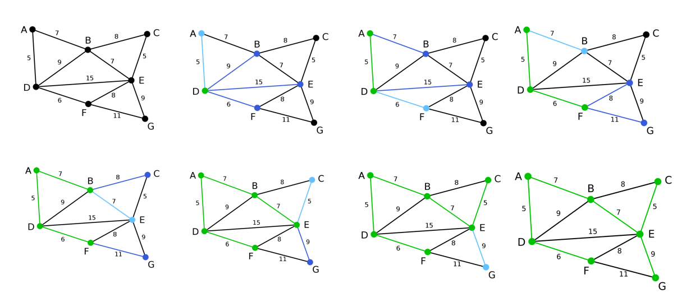

# 最小生成树之Prim算法

最小生成树即由此算法搜索到的边子集所构成的树中，不但包括了连通图里的所有顶点（英语：Vertex (graph theory)），且其所有边的权值之和亦为最小。

**Prim**算法过程如下：

1).输入：一个加权连通图，其中顶点集合为V，边集合为E；   

2).初始化：Vnew = {x}，其中x为集合V中的任一节点（起始点），Enew = {},为空；    

3).重复下列操作，直到Vnew = V：

a.在集合E中选取权值最小的边<u, v>，其中u为集合Vnew中的元素，而v不在Vnew集合当中，并且v∈V（如果存在有多条满足前述条件即具有相同权值的边，则可任意选取其中之一）；

b.将v加入集合Vnew中，将<u, v>边加入集合Enew中；

4).输出：使用集合Vnew和Enew来描述所得到的最小生成树。

考虑下图中的图结构(图来自于[华山大师兄的博客](http://www.cnblogs.com/biyeymyhjob/archive/2012/07/30/2615542.html))



上图可以清晰的描述出Prim算法的过程

C++代码

```c++
/*
最小生成树 Prim算法

*/

#include <iostream>
#include <vector>
#define MAX 10000000

using namespace std;

char VNode[] = { 'A', 'B', 'C', 'D', 'E', 'F', 'G' };
struct edge{
	int start;
	int end;
	
};
ostream& operator << (ostream& os,edge& e){
	os << VNode[e.start] << " --> " << VNode[e.end];
	return os;
}

int main(void){
	
	const int n = sizeof(VNode) / sizeof(char);
	int Matrix[n][n] = {
	        // A,B,C,D,E,F,G
		{ MAX, 7, MAX, 5, MAX, MAX, MAX },
		{ 7, MAX, 8, 9, 7, MAX, MAX },
		{ MAX, 8, MAX, MAX, 5, MAX, MAX },
		{ 5, 9, MAX, MAX, 15, 6, MAX },
		{ MAX, 7, 5, 15, MAX, 8, 9 },
		{ MAX, MAX, MAX, 6, 8, MAX, 11 },
		{ MAX, MAX, MAX, MAX, 9, 11, MAX }
	};  // http://www.cnblogs.com/biyeymyhjob/archive/2012/07/30/2615542.html 
	
	vector<bool> flagArray(n, false);
	vector<int> disArray(n, MAX);  //记录每个点到最小生成树的距离 
	vector<int> nodePair(n, -1); //记录每个点 对应的 最小生成树最近邻的点
	vector<edge> edgeArray;  //记录最小生成树的边
	int start = 0;
	flagArray[start] = true;
	
	for (int i = 0; i < n; i++){
		disArray[i] = Matrix[start][i];
		nodePair[i] = start;
	}

	for (int i = 1; i < n; i++){
		int minDis = MAX;
		int minIndex = -1;
		for (int i = 0; i < n; i++){
			if (!flagArray[i] && disArray[i] < minDis ){
				minDis = disArray[i];
				minIndex = i;
			}
		}

		if (minIndex == -1){
			cout << "不能生成最小生成树" << endl;
			return 0;
		}

		
		edge newEdge = {nodePair[minIndex],minIndex};  //新的边
		edgeArray.push_back(newEdge);

		start = minIndex; //新的点
		flagArray[start] = true;
		disArray[start] = 0;

		for (int i = 0; i < n; i++){
			if (!flagArray[i])
			{
				if (disArray[i] > Matrix[start][i]){
					disArray[i] = Matrix[start][i];  //更新每个点到最小生成树的距离
					nodePair[i] = start; //更新每个点 对应的 最小生成树最近邻的点
				}
					
			}
		}

	}
	cout << "-------------result-------------" << endl;
	for (edge& e : edgeArray){
		cout << e << endl;
	}
	
		
}
```


