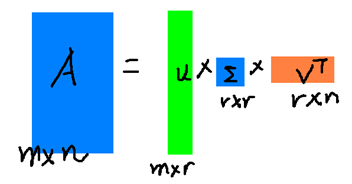

# 主成分分析
在机器学习领域，有相当多的应用与奇异值都可以扯上关系，比如做feature reduction的PCA，做数据压缩（以图像压缩为代表）的算法，还有做搜索引擎语义层次检索的LSI(Latent Semantic Indexing)等。

## 奇异值与特征值基础知识

​    特征值分解和奇异值分解在机器学习领域都是属于满地可见的方法。两者有着很紧密的关系，我在接下来会谈到，特征值分解和奇异值分解的目的都是一样，就是提取出一个矩阵最重要的特征。先谈谈特征值分解吧：

**特征值**

如果说一个向量$v$是方阵A的特征向量，将一定可以表示成下面的形式：
$$
Av = \lambda v
$$
这时候$\lambda$ 就被成为特征向量$v$对应的特征值，一个矩阵的一组特征向量是一组正交向量，特征值分解是将一个矩阵分解成下面的形式：
$$
A = Q\Sigma Q^{-1}
$$
其中Q 是这个矩阵A的特征向量组成的矩阵，$\Sigma$ 是一个对角阵，每一个对角线上的元素就是一个特征值。

一个矩阵其实就是一个线性变换，因为一个矩阵乘以一个向量后得到的向量，其实就相当于将这个向量进行了线性变换。比如说下面的一个矩阵：
$$
M =
\begin{bmatrix}
    3 & 0 \\ 
   0 & 1  \\
\end{bmatrix}
$$

它对应的线性变换为为下面的形式

因为这个矩阵$M$ 乘以一个向量$(x,y)$ 的结果为

$$
\begin{bmatrix}
    3 & 0 \\ 
   0 & 1  \\
\end{bmatrix}
\begin{bmatrix}
    x \\
   y  \\
\end{bmatrix}
= 
\begin{bmatrix}
    3x  \\ 
   y    \\
\end{bmatrix}
$$
上面的矩阵是对称的，所以这个变换是一个对x，y轴的方向一个拉伸变换（每一个对角线上的元素将会对一个维度进行拉伸变换，当值>1时，是拉长，当值<1时时缩短），当矩阵不是对称的时候，假如说矩阵是下面的样子：

$$
M = 
\begin{bmatrix}
    1 & 1\\ 
   0 & 1\\
\end{bmatrix}
$$
这个矩阵所描述的变换为

这其实是在平面上对一个轴进行的拉伸变换（如蓝色的箭头所示），在图中，蓝色的箭头是一个最**主要的**变化方向（变化方向可能有不止一个），**如果我们想要描述好一个变换，那我们就描述好这个变换主要的变化方向就好了**。反过头来看看之前特征值分解的式子，分解得到的Σ矩阵是一个对角阵，里面的特征值是由大到小排列的，这些特征值所对应的特征向量就是描述这个矩阵变化方向（从主要的变化到次要的变化排列）

​    当矩阵是高维的情况下，那么这个矩阵就是高维空间下的一个线性变换，这个线性变化可能没法通过图片来表示，但是可以想象，这个变换也同样有很多的变换方向，我们通过特征值分解得到的前N个特征向量，那么就对应了这个矩阵最主要的N个变化方向。我们利用这前N个变化方向，就可以近似这个矩阵（变换）。也就是之前说的：**提取这个矩阵最重要的特征。**总结一下，特征值分解可以得到特征值与特征向量，特征值表示的是这个特征到底有多重要，而特征向量表示这个特征是什么，可以将每一个特征向量理解为一个线性的子空间，我们可以利用这些线性的子空间干很多的事情。不过，**特征值分解也有很多的局限，比如说变换的矩阵必须是方阵。**

**奇异值**

下面谈谈奇异值分解。特征值分解是一个提取矩阵特征很不错的方法，但是它只是对方阵而言的，在现实的世界中，我们看到的大部分矩阵都不是方阵，比如说有N个学生，每个学生有M科成绩，这样形成的一个N * M的矩阵就不可能是方阵，**我们怎样才能描述这样普通的矩阵的重要特征呢？**奇异值分解可以用来干这个事情，**奇异值分解是一个能适用于任意的矩阵的一种分解的方法**：
$$
A = U\Sigma V^T
$$

假设A是一个N * M的矩阵，那么得到的U是一个N * N的方阵（里面的向量是正交的，U里面的向量称为左奇异向量），Σ是一个N * M的矩阵（除了对角线的元素都是0，对角线上的元素称为奇异值），V’(V的转置)是一个N * N的矩阵，里面的向量也是正交的，V里面的向量称为右奇异向量），从图片来反映几个相乘的矩阵的大小可得下面的图片

 那么奇异值和特征值是怎么对应起来的呢？首先，我们将一个矩阵A的转置 * A，将会得到一个方阵，我们用这个方阵求特征值可以得到：
$$
(A^T A)v_i = \lambda_i v_i
$$
这里得到得$v $就是我们上面的右奇异向量。此外我们还可以得到：
$$
\sigma_i = \sqrt \lambda_i  \\
u_i = \frac{1}{\sigma_i} A v_i
$$
  这里的σ就是上面说的奇异值，u就是上面说的左奇异向量。奇异值σ跟特征值类似，在矩阵Σ中也是从大到小排列，而且σ的减少特别的快，**在很多情况下，前10%甚至1%的奇异值的和就占了全部的奇异值之和的99%以上了**。也就是说，我们也可以用前r大的奇异值来近似描述矩阵，这里定义一下**部分奇异值分解**：
$$
A_{m \times n} = U_{m \times r } \Sigma_{r \times r} V_{r \times n}^T
$$
 r是一个远小于m、n的数，这样矩阵的乘法看起来像是下面的样子

右边的三个矩阵相乘的结果将会是一个接近于A的矩阵，在这儿，r越接近于n，则相乘的结果越接近于A。而这三个矩阵的面积之和（在存储观点来说，矩阵面积越小，存储量就越小）要远远小于原始的矩阵A，我们如果想要压缩空间来表示原矩阵A，我们存下这里的三个矩阵：U、Σ、V就好了。

## PCA计算过程

### 协方差矩阵及其对角化

考虑矩阵$X$， 共有m组数据，每组数据的维度为2
$$
X = 
\begin{bmatrix}
    a_1 & a_2 & ... & a_m\\ 
    b_1 & b_2 & ... & b_m\\
\end{bmatrix}
$$

求其协方差矩阵

$$
\frac{1}{m}X X^T = 
\begin{bmatrix}
    \frac{1}{m} \sum_{i=1}^m a_i^2 & \frac{1}{m} \sum_{i=1}^m a_i b_i \\ 
    \frac{1}{m} \sum_{i=1}^m a_i b_i  &  \frac{1}{m} \sum_{i=1}^m b_i^2 \\
\end{bmatrix}
$$

考虑到协方差矩阵$E$ 为一个对称矩阵，对称矩阵性质有
$$
E = Q\Sigma Q^{-1}  \\
E = Q\Sigma Q^{T}  \\
$$
上式等价，如此协方差矩阵的对角化就很简单了
$$
Q^T E Q =  \Sigma
$$
$\Sigma$为对接爱哦矩阵，其对角元素为各特征向量对应的特征值

### 实例

总结一下PCA的算法步骤：

设有m条n维数据。

1）将原始数据按列组成n行m列矩阵X

2）将X的每一行（代表一个属性字段）进行零均值化，即减去这一行的均值

3）求出协方差矩阵$C = \frac{1}{m} XX^T$

4）求出协方差矩阵的特征值及对应的特征向量

5）将特征向量按对应特征值大小从上到下按行排列成矩阵，取前k行组成矩阵P

6）$Y = PX$即为降维到k维后的数据

考虑一组二维数据
$$
\begin{bmatrix}
    -1 & -1 & 0 & 2 &  0 \\
    -2 & 0 & 0 & 1 &  1 \\
\end{bmatrix}
$$

求得协方差矩阵

$$
C= 
\begin{bmatrix}
    \frac{6}{5} & \frac{4}{5} \\
    \frac{4}{5} & \frac{6}{5} \\
 \end{bmatrix}
$$

特征向量为
$$
c1 
\begin{bmatrix}
    1 \\
    1 \\
\end{bmatrix}
\quad 
c2
\begin{bmatrix}    
 	-1 \\ 
	1 \\
\end{bmatrix}
$$

对特征向量标准化
$$
c1 
\begin{bmatrix}
    \frac{1}{\sqrt2} \\
    \frac{1}{\sqrt2} \\
\end{bmatrix}
\quad 
c2
\begin{bmatrix}    
 	-\frac{1}{\sqrt2} \\ 
	\frac{1}{\sqrt2}\\
\end{bmatrix}
$$

取第一个特征向量乘以数据矩阵
$$
\begin{bmatrix}
    \frac{1}{\sqrt2} & \frac{1}{\sqrt2} 
\end{bmatrix}
\begin{bmatrix}
    -1 & -1 & 0 & 2 &  0 \\
    -2 & 0 & 0 & 1 &  1 \\
\end{bmatrix}
= 
\begin{bmatrix}
    -\frac{3}{\sqrt2} & \frac{1}{\sqrt2} & 0 & \frac{3}{\sqrt2} &-\frac{1}{\sqrt2}
\end{bmatrix}
$$

将数据在坐标系中显示

PCA变换后变成一维，投射过程

参考

> http://www.cnblogs.com/LeftNotEasy/archive/2011/01/19/svd-and-applications.html
>
> http://blog.codinglabs.org/articles/pca-tutorial.html